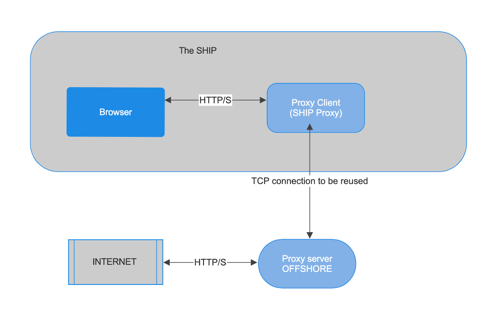

# Proxy Server Setup using Docker

This project sets up a proxy-server and proxy-client running in a Docker containers, which acts as a bridge between the user and the internet. The proxy server is configured to run on port 9090.The proxy client is configured to run on port 8080. This guide will walk you through the steps required to set up a running environment for this project using Docker.

TO SETUP A RUNNING ENVIRONMENT USING DOCKER

### SIMPLY USING DOCKER COMPOSE NO OTHER STEPS REQUIRED
### 1. clone the project
### 2. Docker build, maven packaging will be done inside the image creation
### 3. TORUN: `docker-compose up`
### 4. TOSTOP: `docker-compose down`
### 5. TOSTOP&CLEAN: `docker-compose down --rmi all --volumes --remove-orphans`
### 6. Use curl command to check if the proxy is working, check logs of both server and client containers

  `curl -x http://localhost:8080 http://httpforever.com/`

## Problem statement

It is a cost-cutting time for the cruise ship Royal Caribs. Captain Joe, comes up with a new deal with the satellite internet provider. According to this agreement, the internet service provider will charge the ship based on the number of TCP connections made from the ship. They don’t care about the total data transferred.
Joe called his IT guy Ron and he came up with the new system design. He said he could process all the HTTP requests from the ship with just a single TCP outgoing connection from the ship. In order to access the internet with the new system, everyone should use the proxy running inside the ship. There will not be additional requirements.

The Design
The client application will connect to the proxy(ship proxy) running inside the local network of the ship.
There will be an open TCP connection between the ship proxy and the custom proxy server running offshore. This TCP connection will never be closed and all the http requests coming from the ship will be transmitted through this one by one.

Problem statement
You need to design the proxy client and proxy server.
It should be possible to configure ship proxy as proxy in browser settings(ex chrome).
The system needs to handle the HTTP requests sequentially(one by one). For example, if 3 HTTP requests come to the proxy client parallelly, the system has to fulfil the request 1, then request 2 and finally, request 3.

FYI: proxy client and ship proxy are synonyms.

Expected Output
The source code of the client and server should be uploaded to GitHub
A docker image should be built and published for the client and server.
Should share the command to run the client and server via docker.
Client should expose port 8080 for an incoming connection,
In mac/linux  curl -x http://localhost:8080 http://httpforever.com/  should fetch the website
On windows  cur.exel -x http://localhost:8080 http://httpforever.com/ should fetch the website
Calling curl multiple times with the arguments should give the response consistently. 

